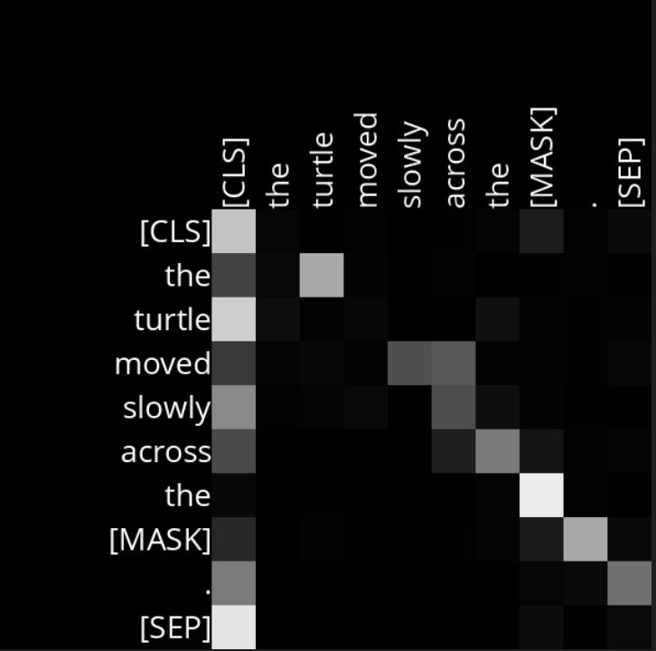
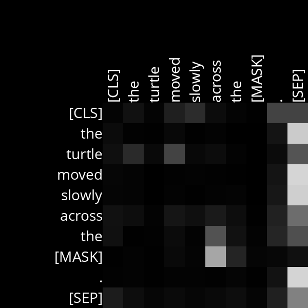

# Analysis

## Layer 2, Head 2

This head shows a strong attention connection between the words “moved,” “slowly,” and “across”.
Example Sentences:
- The turtle moved slowly across the [MASK].

## Layer 10, Head 4

This head shows a strong attention link between the [MASK] token and the word “across.” This relationship is useful for predicting the masked word, which is likely something that naturally follows “across.”

Example Sentences:
- The turtle moved slowly across the [MASK].

